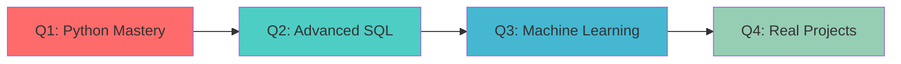

<div align="center">

# 🎯 Nguyễn Trọng Tước

```ascii
╔══════════════════════════════════════════════════════════╗
║  Data Storyteller | Business Analytics Enthusiast       ║
║  Eastern International University (EIU)                  ║
╚══════════════════════════════════════════════════════════╝
```

[](https://git.io/typing-svg)

</div>

---

## 🚀 Quick Stats

```python
class DataAnalyst:
    def __init__(self):
        self.name = "Nguyễn Trọng Tước"
        self.role = "Business Analytics Student"
        self.university = "Eastern International University"
        self.current_focus = ["Data Analytics", "Business Intelligence", "Python"]
        self.coffee_consumed = "∞"
    
    def say_hi(self):
        print("Thanks for dropping by! Let's turn data into decisions together 📊")

me = DataAnalyst()
me.say_hi()
```

<div align="center">

### 🎓 Education Journey

| 🏫 Institution | 📚 Program | 📅 Period |
|:---:|:---:|:---:|
| Eastern International University | Business Analytics | Present |

</div>

---

## 💼 Tech Stack & Tools

<div align="center">

### Languages & Analytics


### Visualization & BI


### Libraries & Frameworks


### Design & Prototyping


</div>

---

## 🎯 2025 Roadmap



<table align="center">
<tr>
<td width="50%">

### 📈 Current Focus
- Advanced Python for data manipulation
- Power BI interactive dashboards
- SQL optimization techniques
- Statistical modeling with R

</td>
<td width="50%">

### 🎯 Next Steps
- Machine learning algorithms
- Predictive analytics
- Big data technologies
- Cloud platforms (Azure/AWS)

</td>
</tr>
</table>

---

## 🔥 What Drives Me

<div align="center">

| 💡 Philosophy | 🎨 Approach |
|:---:|:---:|
| Every dataset tells a story | Visual storytelling over raw numbers |
| Question everything | Data-driven, not opinion-driven |
| Continuous learning | Experiment, fail, learn, repeat |

</div>

### 🌟 My Workflow

```
📊 Data Collection → 🧹 Cleaning → 🔍 Analysis → 📈 Visualization → 💡 Insights → 🎯 Action
```

---

## 🎨 Projects & Interests

<details>
<summary>📊 Data Analytics Projects</summary>

- Building interactive dashboards for business KPIs
- Customer segmentation analysis
- Sales forecasting models
- Market trend analysis

</details>

<details>
<summary>🤖 Automation & Scripts</summary>

- Data cleaning pipelines with Python
- Automated reporting systems
- Web scraping for data collection
- Excel automation with VBA

</details>

<details>
<summary>📚 Learning Resources</summary>

- Online courses (Coursera, DataCamp)
- Kaggle competitions
- Business case studies
- Analytics blogs and communities

</details>

---

## 📫 Let's Connect

<div align="center">

[](mailto:duongvu190405@gmail.com)
[](#)
[](#)

</div>

---

</div>

```javascript
const myLife = {
    passions: ['Data Analytics', 'Problem Solving', 'Visualization'],
    tools: ['Python', 'SQL', 'Power BI', 'Excel'],
    motto: 'Data without insights is just noise',
    currentlyListening: 'House Music 🎧',
    coffeeLevel: 'Maximum ☕☕☕'
};
```

---

<div align="center">

### 💭 Thought of the Day

> *"In God we trust, all others must bring data."*  
> — W. Edwards Deming

---

### 📊 GitHub Analytics


---


### ⭐ If you find my work interesting, give it a star!

</div>

---

<div align="center">

**🌟 Built with 💙 and lots of ☕**

*Last Updated: January 2025*

</div>
